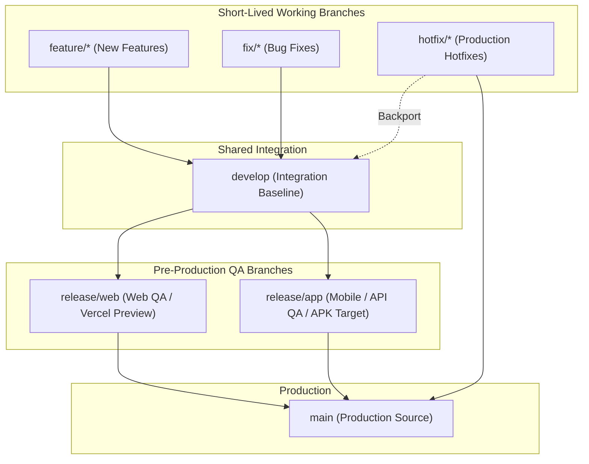

# Turf & Taste — Branch & Release Deployment Workflow

This document defines the official Git branching model, release staging lifecycle, and deployment environment strategy for Turf & Taste.

---

## 1. Branch Architecture & Roles

### Long-Lived Protected Branches

| Branch | Role | Deployment Target | Description |
| :--- | :--- | :--- | :--- |
| **`main`** | **Production** | `https://turf-and-taste.vercel.app` | Production-ready, fully verified source. Only accepts merges from release branches or verified `hotfix/*` branches. |
| **`develop`** | **Integration Baseline** | `turf-and-taste-git-develop-*.vercel.app` | Primary active development branch. All shared backend features, API routes, database schemas, and common frontend logic integrate here first. |
| **`release/web`** | **Web Pre-Production / QA** | `turf-and-taste-git-release-web-*.vercel.app` | Browser testing, responsive web QA, SEO validation, and web UI stabilization before promotion to `main`. |
| **`release/app`** | **Mobile Pre-Production / QA** | `turf-and-taste-git-release-app-*.vercel.app` | Android/iOS physical-device QA, Capacitor plugin validation, and stable HTTPS API target for pre-production APK builds. |

---

## 2. Core Rule: Single Shared Backend

**The backend implementation is strictly shared across all platforms.**

1. **Origin of Truth**: All changes to `server/`, `api/`, database schemas, and API contracts (`src/services/api.js`) must be authored in short-lived branches (`feature/*` or `fix/*`) and merged into **`develop`**.
2. **No Divergent Backends**: Do not create or maintain separate backend logic inside `release/web` or `release/app`.
3. **Propagation**: Shared changes flow from `develop` into `release/web` and `release/app` via clean merges.
4. **Upstream Flow of Release Fixes**: If a bug in shared functionality is identified and resolved during release branch QA, the fix must be merged or cherry-picked back into `develop` immediately to prevent branch drift.

---

## 3. Working Branch Conventions

- **New Features**: `feature/<feature-name>` (branch from `develop`, PR back to `develop`).
- **Standard Bug Fixes**: `fix/<bug-name>` (branch from `develop`, PR back to `develop`).
- **Production Hotfixes**: `hotfix/<hotfix-name>` (branch from `main`, PR to `main`, backport to `develop`).

---

## 4. Environment & Secret Strategy

Environment variables are configured in Vercel project settings and mapped by scope. **Never commit secrets to Git repository files.**

| Variable Name | Purpose | Scope: Production (`main`) | Scope: Preview (`develop`, `release/*`) |
| :--- | :--- | :--- | :--- |
| `DATABASE_URL` | PostgreSQL connection string | Production Supabase Database | Test/Staging Supabase Database |
| `JWT_SECRET` | Admin/Auth token signing key | Production Secret | Preview/Staging Secret |
| `RAZORPAY_KEY_ID` | Razorpay Key ID | Live Production Gateway Key | Test Mode Gateway Key (`rzp_test_*`) |
| `RAZORPAY_KEY_SECRET` | Razorpay Secret Key | Live Production Secret | Test Mode Secret |
| `DEFAULT_ADMIN_USERNAME` | Admin seed credentials | Production Admin | Preview Admin |
| `DEFAULT_ADMIN_PASSWORD` | Admin seed credentials | Secure Production Password | Preview Password |
| `VITE_API_URL` | Mobile API target (baked at build time) | Production API (`https://turf-and-taste.vercel.app/api`) | `release/app` Preview API (`https://turf-and-taste-git-release-app-*.vercel.app/api`) |

---

## 5. Web QA & Mobile QA Behavior

### Web QA (`release/web`)
- **API Resolution**: In standard browsers, requests resolve to same-origin `/api/*` via Vercel serverless rewrites (`vercel.json`).
- **Networking**: Does not depend on `localhost` or private LAN IPs.
- **Auditing**: Browser responsive testing, desktop viewports, cross-browser compatibility (Chrome, Safari, Firefox).

### Mobile QA (`release/app`)
- **API Resolution**: Capacitor native apps run from local WebView origins (`https://localhost` or `capacitor://localhost`) and require an explicit `VITE_API_URL` baked during `npm run cap:sync`.
- **Pre-Production APK Target**: Set `VITE_API_URL=https://turf-and-taste-git-release-app-<user>.vercel.app/api` before building the test APK.
- **Security**: Strict HTTPS only. Cleartext HTTP and `android:usesCleartextTraffic` are disabled. No reliance on local machine IPs.

---

## 6. Vercel Configuration Requirements

1. **Preview Deployment Protection / Authentication**:
   - Vercel's "Deployment Protection" (Vercel Authentication SSO) must remain **Disabled** for the Preview environment so that native Android APKs can perform anonymous HTTPS API calls without receiving HTML authentication redirects.
2. **CORS Policy**:
   - The server CORS middleware in `server/index.js` dynamically authorizes:
     - `https://turf-and-taste.vercel.app` (Production)
     - `^https://turf-and-taste.*\.vercel\.app$` (All Preview deployments: `develop`, `release/web`, `release/app`)
     - `https://localhost` & `capacitor://localhost` (Capacitor WebViews)
