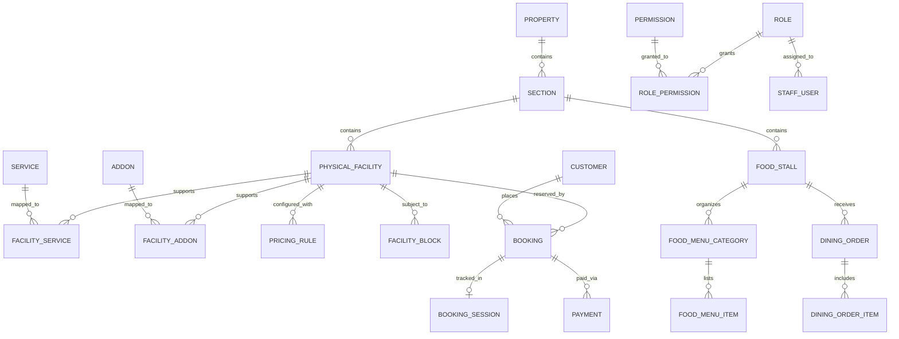

# Turf & Taste — Normalized Target Data Model Specification

## 1. Physical & Operational Entity-Relationship Overview

---

## 2. Core Tables & Schemas

### 2.1 Facility & Service Hierarchy

#### `sections`
| Column | Type | Constraints | Description |
|---|---|---|---|
| `id` | VARCHAR(100) | PK | e.g., `sec_box_cricket`, `sec_pickleball`, `sec_skating`, `sec_cricket_net` |
| `name` | VARCHAR(255) | NOT NULL | e.g., "Box Cricket", "Pickleball" |
| `kind` | VARCHAR(50) | NOT NULL | `sports` or `dining` |
| `display_order` | INTEGER | DEFAULT 0 | Ordering in customer and admin UI |
| `is_active` | BOOLEAN | DEFAULT TRUE | Active toggle |

#### `facilities` (Physical Resources)
| Column | Type | Constraints | Description |
|---|---|---|---|
| `id` | VARCHAR(100) | PK | e.g., `fac_box_cricket_1`, `fac_box_cricket_2` |
| `section_id` | VARCHAR(100) | FK -> sections(id) | Parent section |
| `auto_name` | VARCHAR(255) | NOT NULL | Generated identifier: e.g. "Box Cricket Turf 1" |
| `display_name` | VARCHAR(255) | NOT NULL | Editable name: e.g. "Box Cricket Turf 1" |
| `surface_type` | VARCHAR(100) | NULL | e.g. "Artificial Turf", "Acrylic Pro-Court" |
| `specs_json` | TEXT | NULL | JSON: dimensions, lighting specs, amenities |
| `images_json` | TEXT | NULL | JSON: array of media URLs |
| `is_active` | BOOLEAN | DEFAULT TRUE | Physical operational status |
| `is_bookable` | BOOLEAN | DEFAULT TRUE | Customer booking toggle |

#### `services` (Activities)
| Column | Type | Constraints | Description |
|---|---|---|---|
| `id` | VARCHAR(100) | PK | e.g., `svc_box_cricket`, `svc_cricket_net_practice` |
| `name` | VARCHAR(255) | NOT NULL | Service display title |
| `description` | TEXT | NULL | Service overview |

#### `addons` (Optional Paid Attachments)
| Column | Type | Constraints | Description |
|---|---|---|---|
| `id` | VARCHAR(100) | PK | e.g., `addon_shooting_machine` |
| `name` | VARCHAR(255) | NOT NULL | e.g., "Automated Ball-Shooting Machine" |
| `base_fee` | INTEGER | DEFAULT 0 | Hourly add-on rate in INR |
| `is_active` | BOOLEAN | DEFAULT TRUE | Add-on operational status |

---

### 2.2 Booking & Session Management

#### `bookings`
| Column | Type | Constraints | Description |
|---|---|---|---|
| `id` | VARCHAR(100) | PK | Booking Ref (e.g., `TT-240929-1024`) |
| `facility_id` | VARCHAR(100) | FK -> facilities(id) | **Physical facility occupied** |
| `service_id` | VARCHAR(100) | FK -> services(id) | Primary booked service |
| `customer_id` | VARCHAR(100) | NULL | FK -> customers(id) if logged in |
| `customer_name` | VARCHAR(255) | NOT NULL | Contact full name |
| `customer_phone` | VARCHAR(50) | NOT NULL | Clean 10-digit mobile number |
| `customer_email` | VARCHAR(255) | NULL | Contact email address |
| `scheduled_start_at` | TIMESTAMP WITH TIME ZONE | NOT NULL | Authoritative interval start, derived in `Asia/Kolkata` and stored as an instant |
| `scheduled_end_at` | TIMESTAMP WITH TIME ZONE | NOT NULL | Authoritative interval end; may cross midnight and must be after start |
| `duration_minutes` | INTEGER | NOT NULL | Exact whole-hour customer duration in minutes; extensions are recorded separately in 15-minute increments |
| `delivery_preference` | VARCHAR(50) | DEFAULT 'whatsapp' | `whatsapp` or `sms` |
| `payment_type` | VARCHAR(50) | NOT NULL | `deposit` or `full` |
| `total_amount_paise` | INTEGER | NOT NULL | Total contracted price in the smallest INR unit (paise) |
| `amount_paid_paise` | INTEGER | NOT NULL | Amount paid online / counter in paise |
| `payment_status` | VARCHAR(50) | DEFAULT 'Pending' | `Pending`, `Paid`, `Failed` |
| `booking_status` | VARCHAR(50) | DEFAULT 'Confirmed' | `Pending`, `Confirmed`, `Checked In`, `In Progress`, `Completed`, `Cancelled` |
| `source` | VARCHAR(50) | DEFAULT 'customer_self'| `customer_self`, `staff_walkin` |
| `created_at` | TIMESTAMP | DEFAULT CURRENT_TIMESTAMP | Creation timestamp |

#### `booking_sessions` (On-Ground Ground Realities)
| Column | Type | Constraints | Description |
|---|---|---|---|
| `booking_id` | VARCHAR(100) | PK, FK -> bookings(id)| 1-to-1 session record |
| `checked_in_at` | TIMESTAMP | NULL | Staff QR scan timestamp |
| `actual_start_at` | TIMESTAMP | NULL | Physical court handover timestamp |
| `actual_end_at` | TIMESTAMP | NULL | Physical court vacating timestamp |
| `delay_minutes` | INTEGER | DEFAULT 0 | Ground delay in minutes |
| `delay_reason` | VARCHAR(255) | NULL | Delay category/explanation |
| `extension_minutes` | INTEGER | DEFAULT 0 | Total approved extension |
| `extension_charge` | INTEGER | DEFAULT 0 | Extension fee charged (0 if free) |
| `operator_id` | VARCHAR(100) | NULL | Staff user who authorized session |

---

### 2.3 Dining & Ordering

#### `food_stalls`
| Column | Type | Constraints | Description |
|---|---|---|---|
| `id` | VARCHAR(100) | PK | e.g., `stall_dugout_cafe` |
| `name` | VARCHAR(255) | NOT NULL | Stall name |
| `description` | TEXT | NULL | Stall overview |
| `section_id` | VARCHAR(100) | FK -> sections(id) | Dining section owning the stall |
| `operating_hours_json` | TEXT / JSONB | NOT NULL | Structured per-day operating schedule; not a display-only string |
| `is_active` | BOOLEAN | DEFAULT TRUE | Active status |

#### `dining_orders`
| Column | Type | Constraints | Description |
|---|---|---|---|
| `id` | VARCHAR(100) | PK | Order Ref (e.g., `ORD-2409-881`) |
| `stall_id` | VARCHAR(100) | FK -> food_stalls(id) | Target food stall |
| `table_number` | VARCHAR(50) | NOT NULL | **Customer table number** |
| `customer_name` | VARCHAR(255) | NULL | Customer name |
| `order_status` | VARCHAR(50) | DEFAULT 'Received' | `Received`, `Preparing`, `Ready`, `Delivered`, `Completed`, `Cancelled` |
| `source` | VARCHAR(50) | DEFAULT 'customer_app'| `customer_app`, `staff_pos` |
| `total_amount_paise` | INTEGER | NOT NULL | Server-calculated bill amount in paise |
| `created_at` | TIMESTAMP | DEFAULT CURRENT_TIMESTAMP | Order placement time |

---

## 3. Required Cross-Cutting Invariants

1. **Canonical booked interval:** New-domain availability uses `scheduled_start_at` / `scheduled_end_at` and physical `facility_id`, never an independently parsed display string. Legacy `date`, `time_slot`, and `duration` fields are compatibility fields only during migration.
2. **24/7 schedules:** A schedule must represent 24/7 explicitly (`is_24x7 = true`) or through a validated normalized interval ending on the next day. Equal open/close minute values must never be left ambiguous.
3. **Money:** All newly introduced monetary columns, pricing snapshots, deposits, extensions, and dining line totals are non-negative integer paise. The booking and order record stores the accepted quote/pricing snapshot used at confirmation.
4. **Physical-resource integrity:** `facility_services` and `facility_addons` must constrain valid service/add-on selections for a physical facility. The shooting-machine add-on attaches to `fac_cricket_net_1`; it never creates a second bookable physical facility.
5. **Guest safety:** Guest contact data is not silently linked to a customer account. A later account-link requires verified possession of the same contact channel or a one-time signed booking-history link, plus an immutable link-audit record.
6. **State integrity:** Application-level transition checks (and, where practical, database constraints) prevent a terminal `Cancelled` booking from becoming confirmed again. Pending-payment holds are separate from confirmed bookings.
