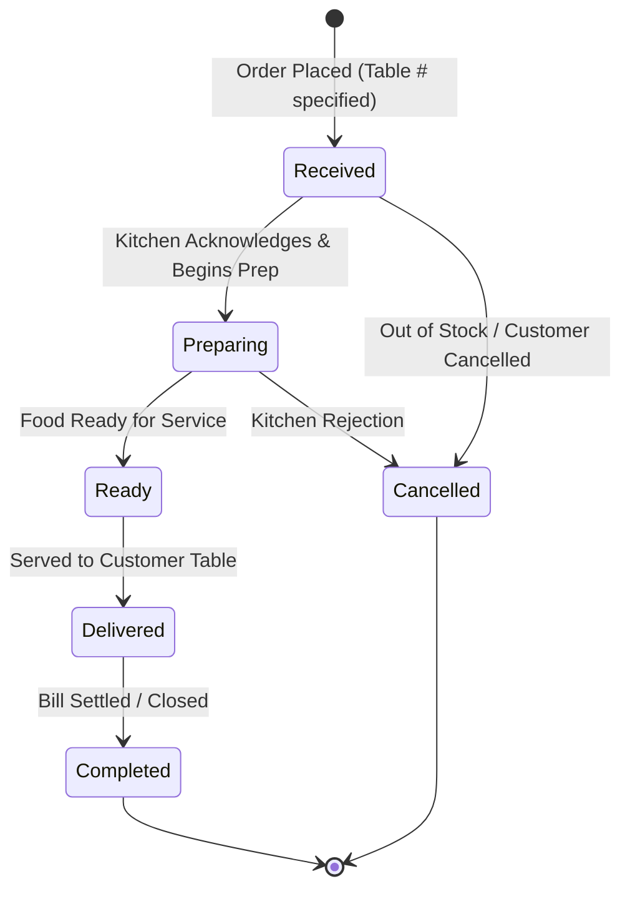

# Turf & Taste — Dining & Food Ordering Architecture

## 1. Property Dining Model

The Dining & Café area is an integral section of the Turf & Taste Patan campus.

### Core Structure:
1. **Multiple Independent Stalls/Shops:** The dining area houses distinct food stalls (e.g. `The Dugout Café`, `The Pavilion Parlour`, `Patan Chaat Counter`).
2. **Operating Hours:** Each stall configures its own independent operating schedule (unlike sports facilities which operate 24/7).
3. **Menu Hierarchy:** `Stall` -> `Menu Category` -> `Menu Item` (with price, dietary flag, prep time, availability toggle).

---

## 2. Customer Dining Scope (Informational / Discovery Only)

> **AUTHORITATIVE RULE:** Customer dining is strictly informational/discovery only. There is NO customer food ordering, cart, checkout, or food payment on the customer app.

### Customer App Dining Flow:
1. Customer browses outlets (Sports Café, Gourmet Parlour) and menu items on their mobile device.
2. Customer views outlet information, categories, menu item descriptions, prices, images, and availability.
3. Customer views operating hours and outlet details.

### Admin Dining CMS:
1. Admin manages outlets, food categories, menu item descriptions, paise prices, and instant availability toggles.
2. Admin Dining CMS is the authoritative source for all dining content displayed to customers.

---

## 3. Order Lifecycle & Statuses

