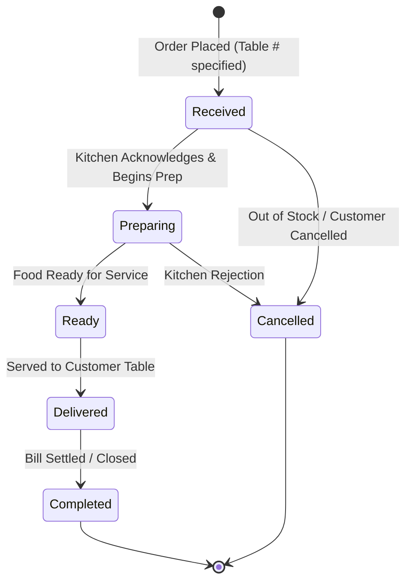

# Turf & Taste — Dining & Food Ordering Architecture

## 1. Property Dining Model

The Dining & Café area is an integral section of the Turf & Taste Patan campus.

### Core Structure:
1. **Multiple Independent Stalls/Shops:** The dining area houses distinct food stalls (e.g. `The Dugout Café`, `The Pavilion Parlour`, `Patan Chaat Counter`).
2. **Operating Hours:** Each stall configures its own independent operating schedule (unlike sports facilities which operate 24/7).
3. **Menu Hierarchy:** `Stall` -> `Menu Category` -> `Menu Item` (with price, dietary flag, prep time, availability toggle).

---

## 2. Table-Based Customer Food Ordering (In Scope)

> **CRITICAL ARCHITECTURAL UPDATE:** The previous prototype rule restricting Dining to "view-only discovery" is OBSOLETE. Customer food ordering is officially in scope.

### Customer App Order Flow:
1. Customer browses stalls and menu items on their mobile device.
2. Customer selects items and enters their physical **Table Number** (or scans Table QR).
3. Customer places order (`source = 'customer_app'`).
4. Kitchen receives order tagged with Table Number.

### Stall / Staff Portal Order Flow:
1. Counter staff or waiter enters walk-in table or takeout orders directly in the Staff POS view (`source = 'staff_pos'`).
2. Staff updates order preparation progress and marks delivery.

---

## 3. Order Lifecycle & Statuses

