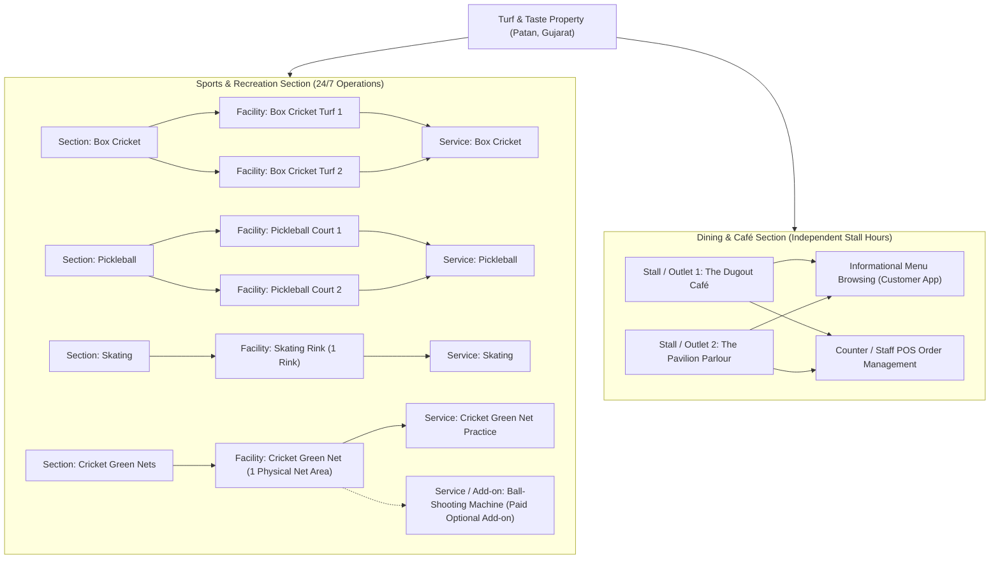

# Turf & Taste — Product Truth & Authoritative Platform Foundation

## 1. Property Model & Core Identity

Turf & Taste is a **single multi-facility sports, recreational, and dining property** located exclusively in:
**Patan, Gujarat, India** (Timezone: `Asia/Kolkata`, IST, UTC+05:30).

### What Turf & Taste IS:
- A unified sports & dining campus situated on a single physical property in Patan, Gujarat.
- A property housing multiple sports sections (Box Cricket, Pickleball, Skating, Cricket Green Nets) and a dedicated Dining Section with multiple food stalls/cafés.
- A single destination offering 24/7 sports facility operations, dynamic multi-tier pricing, advance & walk-in bookings, operational session management with QR check-in, and informational/discovery dining (outlets, menus, descriptions, prices, availability).

### What Turf & Taste IS NOT (Strict Prohibitions):
1. **NO Multiple Branches / Cities:** Turf & Taste does NOT have branches in Bopal, Ahmedabad, South Bopal, Gandhinagar, or anywhere outside Patan, Gujarat. Any reference to Bopal, Ahmedabad, or external city branches is an obsolete prototype artifact and strictly forbidden.
2. **NO External Venues / Arenas:** Turf & Taste is NOT an aggregator or marketplace listing disparate arenas (e.g. "Skyline Arena", "Green Valley Turf"). All facilities belong directly to the single Turf & Taste Patan property.
3. **NO Location Selector on Home:** The Home screen does not need a discovery location picker (e.g. "Bopal, Ahmedabad") because the user is interacting with the Turf & Taste Patan property. Detailed physical address and geo-coordinates belong in **About**, **Contact**, footer, and map directions.

---

## 2. Top-Level Physical & Section Hierarchy

The domain strictly distinguishes between sections, physical facilities, services, and add-ons:

---

## 3. Sports Facilities Setup (Current Baseline)

| Category / Section | Physical Facilities | Physical Units | Services & Paid Add-Ons |
|---|---|---|---|
| **Box Cricket** | Box Cricket Turf 1, Box Cricket Turf 2 | 2 distinct turfs | Standard Box Cricket match play |
| **Pickleball** | Pickleball Court 1, Pickleball Court 2 | 2 distinct courts | Standard Pickleball singles / doubles play |
| **Skating** | Skating Rink | 1 dedicated rink | Roller / Inline skating sessions |
| **Cricket Green Nets** | Cricket Green Net Area | 1 physical practice lane | Standard Net Practice; **Optional Add-on:** Automated Ball-Shooting Machine |

> **Key Architectural Rule:** The automated Ball-Shooting Machine is NOT a separate physical court or facility. It is a paid optional service/add-on on the single physical Green Net practice facility. CMS enables/disables and prices this add-on independently.

---

## 4. Authoritative Business Rules Summary

1. **Operating Hours:** Sports facilities operate **24/7** conceptually. Unavailability is determined by confirmed bookings, approved extensions, maintenance blocks, tournament blocks, or administrator closures with customer-facing explanations.
2. **Customer Booking Durations:**
   - **Quick Durations:** `1 Hour` and `2 Hours` starting on whole-hour boundaries (`:00`).
   - **Custom Durations:** Whole-hour lengths (`1h`, `2h`, `3h`, `4h`...) starting on quarter-hour boundaries (`:00`, `:15`, `:30`, `:45`).
   - Obsolete fixed `90-minute / 1.5 hr` booking is removed.
3. **Booking Lead Time:** Customer self-service requires minimum **1 Hour lead time**. Admin/Staff counter walk-ins can book immediately.
4. **Walk-In Payment Rule:** Walk-ins booked >= 1h in advance can pay token deposit or full payment; walk-ins inside the 1-hour threshold require **Full Payment**.
5. **Booking Horizon:** No artificial maximum advance-booking horizon (customers can book arbitrarily far in advance as long as pricing/schedules exist).
6. **Cancellation & Refunds:** Customer or Admin can cancel a booking at any time. **Current Refund Policy = 0% / NONE**. Cancellation is permanent and terminal.
7. **Dining Model:** Dining is on the same property with multiple stalls. **Customer dining is strictly informational/discovery only** (outlet discovery, menu browsing, descriptions, prices, availability). No customer food ordering, cart, checkout, or food payment.
8. **Customer Accounts & Guest Flow:** Guest booking is first-class (no mandatory login). Customers can authenticate via **Mobile, Email, or Username + Password**. Delivery preferences (**WhatsApp** or **SMS**) are stored per booking.
