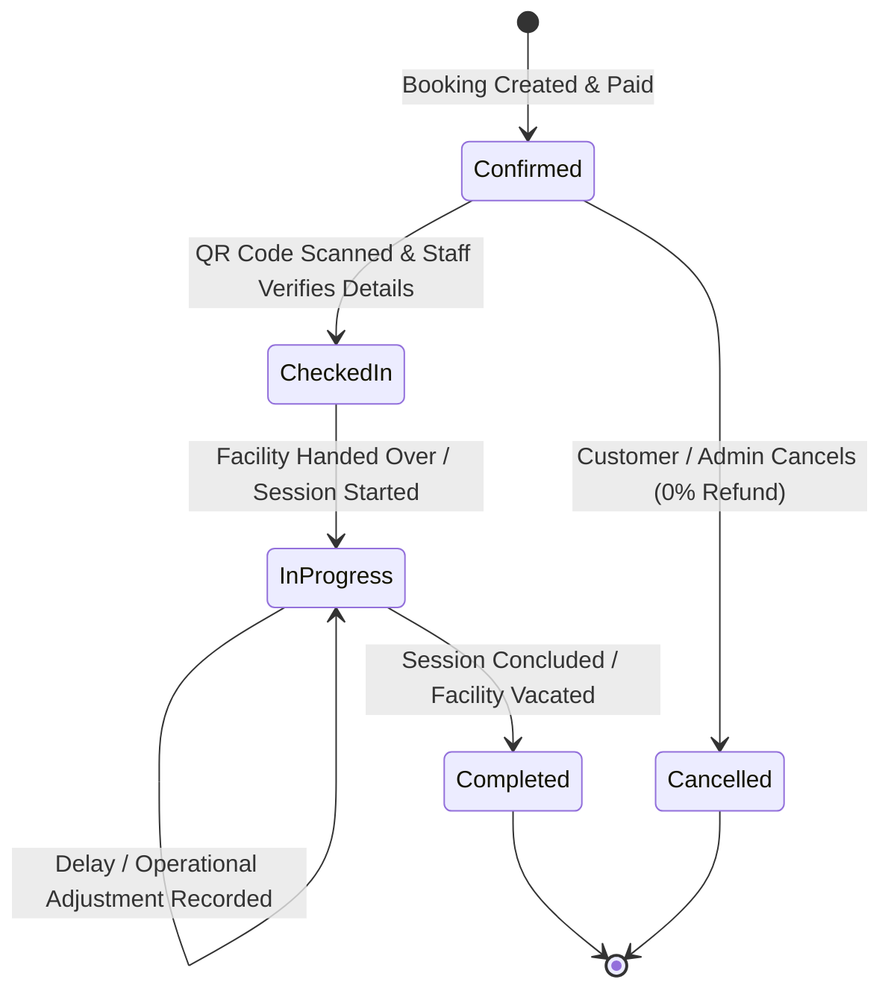

# Turf & Taste — Session Operations & On-Ground Management

## 1. Operational Session Lifecycle

On-ground session management bridges digital booking reservations with real-world physical turf operations:

---

## 2. Scheduled Time vs. Actual Session Time

The database and APIs preserve both scheduled expectations and ground realities without overwriting original booking data:

| Field | Description | Example |
|---|---|---|
| `scheduled_start` | Contracted booking start time | `2026-10-01 18:00:00+05:30` |
| `scheduled_end` | Contracted booking end time | `2026-10-01 19:00:00+05:30` |
| `actual_start` | Real timestamp when court was handed over | `2026-10-01 18:08:15+05:30` |
| `actual_end` | Real timestamp when player group left court | `2026-10-01 19:10:00+05:30` |
| `delay_minutes` | Total operational delay recorded | `8` |
| `delay_reason` | Reason category (`facility_overrun`, `customer_late`, `weather`, `maintenance`) | `facility_overrun` |
| `adjustment_type` | Operational compensation chosen by staff | `free_extension` / `paid_extension` / `no_adjustment` |

---

## 3. Staff Discretion & Ground Scenarios

### Scenario A: Facility / Turf & Taste Handover Delay (Turf Late by 10 mins)
- Customer arrived on time, but prior tournament/session overran.
- Staff checks next booking schedule on that physical turf.
  - **If turf is free after scheduled end:** Staff grants a **Free Extension of 10 minutes** (`actual_end` extended, `adjustment_charge = 0`).
  - **If turf has an immediate next booking:** Staff cannot extend into the next customer's slot (**Next Booking Protection**). Staff records operational note and offers concession/credit.

### Scenario B: Customer Arrives Late (Player Group Late by 15 mins)
- Turf was ready at `18:00`, but customer arrived at `18:15`.
- **Default Rule:** Session still ends at scheduled end `19:00`.
- **Staff Discretion:** If turf is vacant after `19:00` and customer requests extra time, staff may offer a paid extension or courtesy buffer at manager discretion.

---

## 4. Next Booking Conflict Protection

Before staff can approve any manual extension or delayed end-time, the system executes an atomic check against:
1. Subsequent confirmed reservations on the same physical facility.
2. Scheduled maintenance or tournament blocks.
3. If a conflict exists within the proposed extended window, the system strictly blocks the extension and alerts staff.
