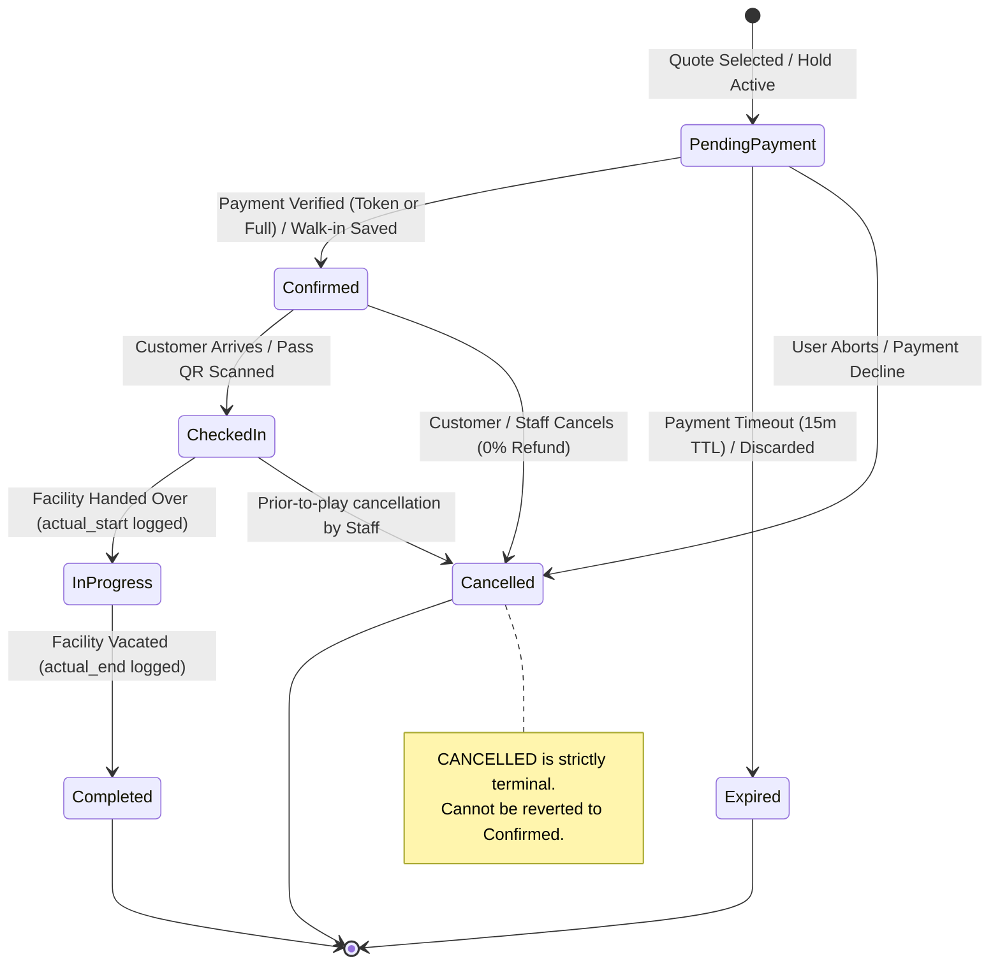
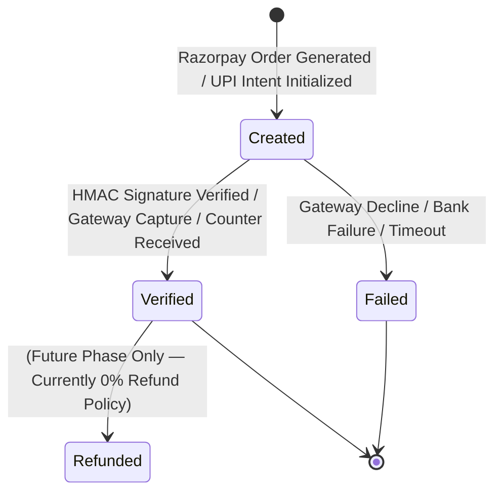
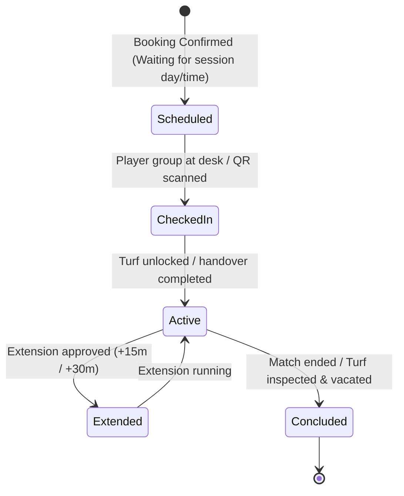
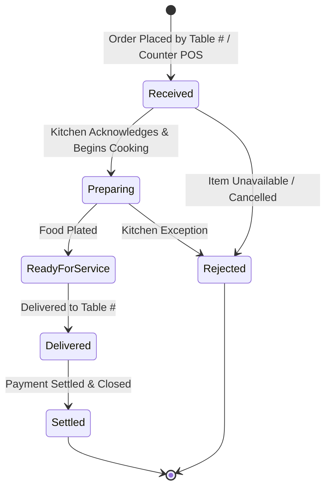

# Turf & Taste — Domain State Machines & Lifecycle Specifications

## 1. Booking State Machine

---

## 2. Payment State Machine

> **Separation Rule:** Payment status (`created`, `verified`, `failed`) is distinct from Booking status (`Confirmed`, `In Progress`, `Completed`, `Cancelled`). A payment cannot create a booking without cryptographic verification.

---

## 3. Ground Session State Machine

---

## 4. Dining Order State Machine

