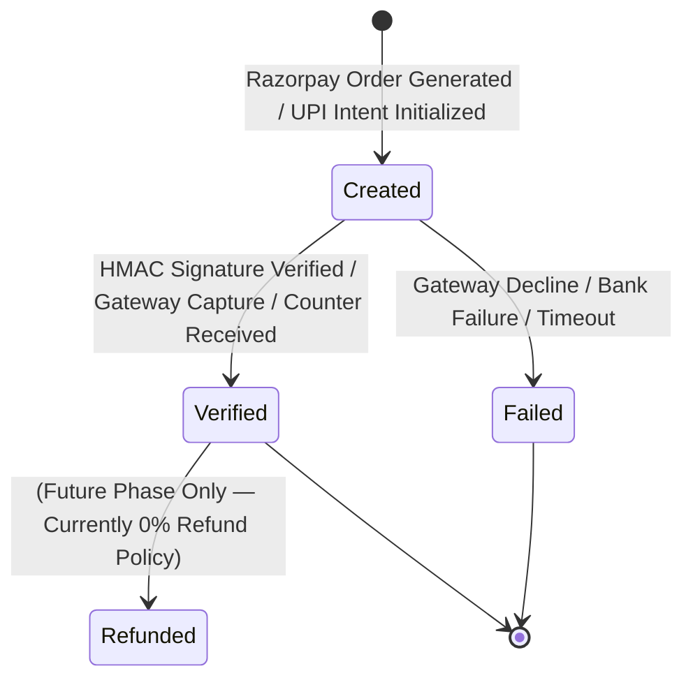
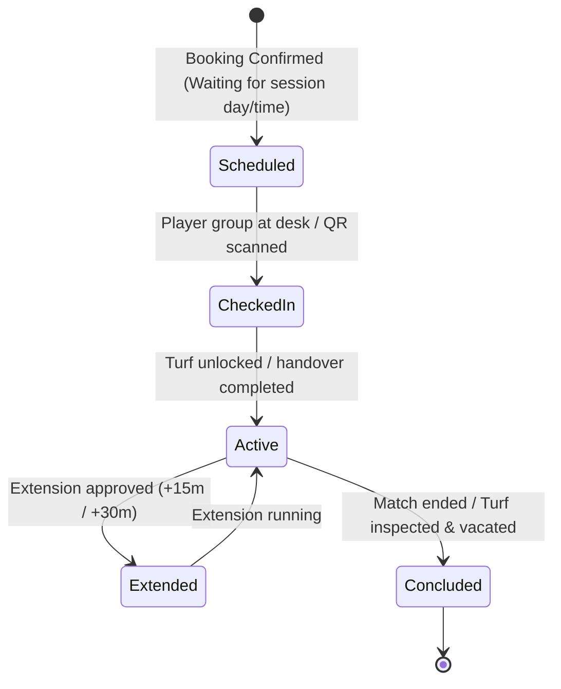
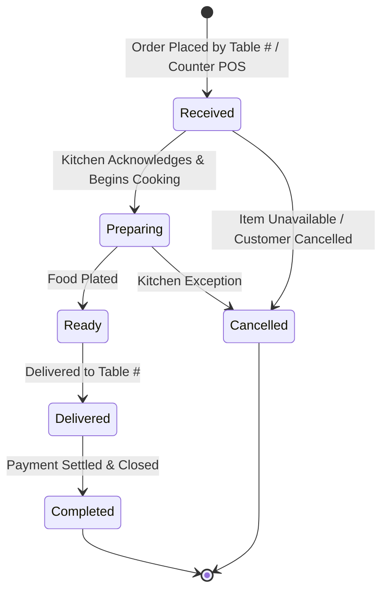

# Turf & Taste — Domain State Machines & Lifecycle Specifications

## 1. Booking State Machine

```mermaid
stateDiagram-v2
    [*] --> PendingPayment: Quote Selected / Hold Active
    PendingPayment --> Confirmed: Payment Verified (Token or Full) / Walk-in Saved
    PendingPayment --> Expired: User abort, payment decline, or hold timeout / Released
    Expired --> [*]

    Confirmed --> CheckedIn: Customer Arrives / Pass QR Scanned
    CheckedIn --> InProgress: Facility Handed Over (actual_start logged)
    InProgress --> Completed: Facility Vacated (actual_end logged)
    Completed --> [*]

    Confirmed --> Cancelled: Customer / Staff Cancels (0% Refund)
    CheckedIn --> Cancelled: Customer / Staff Cancels (0% Refund)
    InProgress --> Cancelled: Customer / Staff Cancels; retain actual-session history
    Cancelled --> [*]

    note right of Cancelled
        CANCELLED is strictly terminal and cannot be reverted.
        Pending-payment expiration is not a cancelled booking:
        no confirmed booking exists until payment is verified.
    end note
```

---

## 2. Payment State Machine



> **Separation Rule:** Payment status (`created`, `verified`, `failed`) is distinct from Booking status (`Confirmed`, `In Progress`, `Completed`, `Cancelled`). A payment cannot create a booking without cryptographic verification.

---

## 3. Ground Session State Machine



---

## 4. Dining Order State Machine


